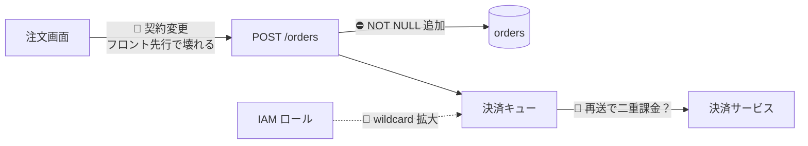

# Report format

## Output language

**Write the report in the language the user is writing in.** Headings, findings, explanations, and
suggested comments — all of it. When that is genuinely unclear, use Japanese: this toolkit is
maintained in Japanese, and a report in a language its reader does not use is a report nobody reads.

This used to say "in Japanese" flatly, in five separate files. That is correct for the machine it was
written on and wrong everywhere else — an English-speaking user who installed the toolkit got reports
they could not read, from skills whose own instructions they could read fine.

Leave these in their original form, because changing them breaks them or loses precision: file paths,
identifiers, commands, code excerpts, log output, severity emoji, error strings, and quoted text from
the diff. A suggested comment names real symbols, so the symbols stay as they are inside the
surrounding sentence.

These instructions are in English because they are read by the model; the report is read by a person.
Do not mirror the language of this file into the output.

## The five things every review must contain

Not a template to fill in — the five things a review is *for*. A report missing any of them is
incomplete regardless of how many findings it has, and the last row is the one usually skipped.

| | Required | Where |
|---|---|---|
| **0** | **変更マップ** — the findings placed on a diagram of what the change touches, when the change has a shape. Skipped is fine; **silently skipped is not.** | 「変更マップ」節 |
| **1** | **What actually changed.** The units, the observable difference for someone else, the mechanism, and the blast radius. **Written first, and written even when nothing was found.** | 「変更内容」節 |
| **2** | **A critical multi-perspective review as a tech lead for that domain**, with **architecture, aggregate and transaction boundaries, and security weighted highest** and never collapsed away. | The layer's perspective clusters; the **five** that survive every collapse are listed in `review-process.md` |
| **3** | **For every finding: why this implementation is wrong, in detail** — mechanism, the concrete failure, the path that reaches it, and whether the *shape* causes it — **plus the exact line and the comment to leave there.** | [How each finding is presented](#how-each-finding-is-presented) |
| **4** | **Severity as levels, with the criteria stated**, so the reader knows what blocks and what does not. | [Bucketing](#bucketing) |

Two more that are not negotiable either, because without them the four above can be quietly hollow:

| | Required | Where |
|---|---|---|
| **5** | **What was read versus assumed**, and what was not checked at all. A clean result means "not detected at this depth", never "safe". | 🔎 in the skeleton |
| **6** | **The refutation count.** How many findings were raised and killed. Zero refutations means the pass was not calibrated — say which it was. | 🔬 in the skeleton |

## Merging duplicates

Findings on the same `file` within roughly ±5 lines, or sharing a root cause, **merge into one**:
list both perspectives, take the **highest severity**, and combine `why` and `recommendation`. The
same problem must not appear once per perspective that noticed it.

## Bucketing

Each finding is counted in **exactly one** bucket.

**State the criteria in the report itself**, as a one-line legend under the summary table. A reader who
does not know what separates 🔴 from 🟡 cannot act on either, and "critical" means something different in
every review they have read before this one.

| Bucket | Contents | What it means for the reader |
|---|---|---|
| ⛔ | `irreversible=true`. Never also counted under 🔴. | **Do not merge.** Shipping it cannot be taken back: data loss, a destructive migration, a broken contract for a consumer you do not control, a permission already used. |
| 🔴 | `critical` that is not irreversible. | **Fix before merge.** A reachable correctness, security or tenancy defect — with the path written out, not assumed. |
| 🟡 | warning | **Should fix, does not block.** Real but bounded: recoverable, or reachable only in a state you can accept for now. |
| 💡 | info | **Optional.** Prefix the comment `Nit:` so the author can see it does not block. |
| 🧭 | Design soundness, system-wide and propagation risk, upgraded unverified clears. Things a senior would ask about but cannot call defects. **Exempt from noise caps.** | **A judgement call, not a defect.** "This shape will cost us" — worth a decision, not a fix. When the harm becomes legible it belongs in 🔴/⛔ instead. |
| 👤 | Needs a human: unverified clears, unresolved reachability. | **Blocked on someone.** Says what to look at or whom to ask to settle it. |

Summary-table totals must equal the post-merge finding count.

**Output budget** — **the only cap on findings, and it discloses what it cuts**: 🟡 at most ~7, 💡 at
most ~5; fold the overflow into a single aggregate note and count it in 🔬. Never truncate ⛔, 🔴, or 🧭.
The find phase has no rank cap of its own (`finding-discipline.md`): two caps in series meant the inner
one dropped findings the outer one’s note never counted.

## How each finding is presented

Every ⛔ and 🔴 finding carries **four parts, all required**. 🟡 carries all four but may be terser. 💡
may collapse to a one-line summary.

**1. 📍 Location** — `path/to/file.ts:123`, the **exact line** the inline comment attaches to. Ranges as
`:120-135`. A finding without a line is not a finding; it is an impression.

**2. Why this implementation is wrong** — the technical rationale, and **the part that must not be
short.** Four things, in this order:

- **What the code does now.** The actual mechanism, read from the file rather than inferred from the
  name. Quote the two or three lines that matter.
- **The concrete failure.** A specific input and state → the specific wrong result. Not "may cause
  inconsistency" but "two requests arriving inside the same transaction window both read version 3, both
  write version 4, and the second silently discards the first's line items".
- **The path that reaches it.** Which caller, which permission, which timing. This is what separates a
  branch that exists in the code from a branch that runs in production, and it is why the severity is
  what it is.
- **Why the shape causes it, not just this line.** Is this a slip, or does the structure make the slip
  likely — an invariant no guard enforces, a default whose correctness depends on every caller
  compensating, a type that permits the invalid state? A finding that only fixes the line leaves the next
  one to be written.

> **This part is never dropped for being long.** It is the part that makes a finding actionable by
> someone who did not do the review, and the part a reader uses to decide whether to believe it. If it
> cannot be written, the finding is not understood well enough to report — say so and move it to 👤.

**3. Plain explanation** — two to four sentences, no jargon (gloss it if unavoidable): what the situation
is now, what is wrong, and **whose problem it becomes if left alone**. This is for the person reading the
report, not the person fixing the code. It may be brief; it may not be absent.

**4. 💬 Suggested comment**, as a block quote, ready to paste on that line:

> **[🔴/🟡] One-line summary.** What the problem is (concrete input and state → result) → why it
> matters → the recommended fix (the relevant API, the direction of the smallest diff, pseudocode if
> useful). When confidence is low, say "needs confirming: X".

The comment must **stand on its own when displayed as a single line**, since the review UI shows it
attached to a line with nothing around it. It is a compression of part 2, not a replacement for it —
**the comment is what the author reads at the line; part 2 is what makes the report reviewable.**

Each ⛔ row gets one 💬 suggested comment with its line. Each 👤 item must state, in the comment,
**what to look at or whom to ask** to settle it.

**Mark what is optional, inside the comment.** Anything that is a preference rather than a defect opens
with **`Nit:`** — the widely used convention for "worth considering, not a reason to hold this up". Four
characters, and it removes the most common failure of an otherwise good review: the author cannot tell
which of eleven comments actually block, so they either do all of them or ignore the lot.

**A personal style preference is not a finding.** Where the project states no convention, the author's
choice stands. A review that spends its credibility on formatting has none left for the migration that
loses data. `finding-discipline.md` has the suppression rule; this is its presentation half.

**This is a proposal, not a post.** The skill is read-only. Actually posting with
`gh pr review --comment` or `gh api` happens only when the user explicitly asks, and then the
bodies above are used verbatim.

---

## 変更マップ — 一枚絵、所見を載せたもの

**A Mermaid block, first in the report, before the change summary.** GitHub, GitLab and most Markdown
viewers render ` ```mermaid ` fences natively, so this needs no tool and looks the same from Claude and
from Cursor.

**What makes it worth drawing is not the change — it is the findings placed on it.** A diagram of what a
diff touches is something the file list already says. A diagram that shows **where the risk sits** is the
one thing a reader cannot reconstruct from a list of findings, because a finding names a file and the
reader has to hold the topology in their head to see that two of them are the same edge.

Rules, and each exists because the obvious version of this is worse than nothing:

- **Nodes are what the reader recognises** — a screen, an endpoint, a table, a queue, a resource. **Not
  file paths and not class names.** A map of internal structure is the diff again.
- **Edges are the ones the change affects**, and an edge carries its risk marker: `⛔` irreversible,
  `🔴` critical, `🧭` design doubt. **An unmarked edge means it was looked at and nothing was found** —
  say so in the legend, so a clean edge is a statement rather than an omission.
- **Only findings at ⛔ / 🔴 / 🧭 go on the map.** 🟡 and 💡 belong in the table; putting them on the map
  flattens severity into "everything is marked" and the map stops carrying information.
- **A finding on the map is also in the table.** The map is an index, never the only place something
  appears — a reader who skips the diagram must lose nothing.
- **Cap it at roughly a dozen nodes.** Past that a reader scans it like a list, which the table already
  does better. When the change is genuinely wider, group by area and name what was collapsed.
- **Skip it when the change has no shape.** One file, one flag, one value — the table says everything and
  a diagram of one node is noise. **Say that you skipped it and why**, so a missing map is never read as
  a forgotten one.



For a cross-layer review the map is **the only place both sides of a boundary appear at once**, which is
what the layer reviews structurally cannot produce. For a single-layer review it is optional — draw it
when the layer has internal topology worth showing, skip it when it does not.

## Report skeleton

Replace `<Layer>` with Backend, Frontend, or Infra.

```markdown
## <層> レビュー報告

<!-- 変更マップ（Mermaid）。形がある場合のみ。無い場合は飛ばした旨を書く -->

### 変更内容 — 常に最初、所見が無くても書く

**所見より先に書き、所見がゼロでも書く。** 差分を知らない読者は、これ無しにどの重要度も判断できない。問題から始まるレビューは、**何をレビューしているのかを確立する工程を飛ばしている。**

**表で書く。** 散文の箇条書きだと「観測できる変化」と「実装の説明」が混ざり、混ざったものは読者が仕分ける羽目になる。列があれば空欄が見える。

| 領域 | 変更前 | 変更後 | なぜ（読み取れた意図） |
|---|---|---|---|
| 読者が認識するもの（画面・エンドポイント・テーブル・キュー・リソース）。**ファイルパスとクラス名は禁止** | 現在の挙動や値、短く。新規追加は `—` | 何になるか。短く | 差分・spec・PR 説明から読み取れる意図。**読み取れなければ「不明」と書く** —— それ自体が所見（👤）で、意図が無ければ意味的な正しさは判定できない |

`/da-pr-describe` と同じ4列にしてある。**同じ変更について2つの語彙を持つと、レビューと PR 説明が食い違って読者が突き合わせる作業を負う。**

表の下に2つ、散文で:

- **仕組み**: 2〜3文。**仕組みを説明できないなら、まだレビューできる状態ではない。**
- **影響範囲**: Step 2 の追跡で出た関連ドメイン・モジュール・画面・スタック —— **そのうち読まなかったものも名指しする。**

### ⛔ 不可逆な箇所（最優先・検証済み）
| Location | Kind | Why it cannot be undone | Must confirm before release |
|---|---|---|---|
| `file:line` | dropped column / API break / deletion / shared-function fan-out / resource replacement | … | … |

(each row followed by one 💬 suggested comment with its line)

### 🔴 重大 / 🟡 警告 / 💡 参考 / 👤 人間の判断が必要
Each finding in the three-part set above. 💡 may be one line.

### 🧭 設計とシステム全体への疑い
Each item: the doubt — why it is concerning — how to settle it. May fall outside the diff.

### 🔎 このレビューの確度 —— 綺麗な結果を信じる前に必ず読む
- **What was read versus what was assumed.** Especially: did you actually open the shared or base
  code that the high-risk parts lean on? Cite `file:line`.
- Areas covered only shallowly, and what could not be confirmed. Honestly.
- The caveat: this result means "no defect was detected locally in the diff at this depth". It does
  not mean "a senior signed off on the design".

### 🔬 除外したもの（参考・件数のみ）
- N refuted during verification
- N scored below the confidence threshold
- N folded into the aggregate note by the output budget (🟡/💡 only)
(one-line summaries only if useful — do not restate them)

### 📊 集計
| Bucket | Count |
|---|---|
| ⛔ Irreversibility hotspots | |
| 🔴 Critical | |
| 🟡 Warning | |
| 💡 Info | |
| 🧭 Design / system-wide | |
| 👤 Needs human | |
| 🔬 Filtered out | |
```

## When the change is an open PR

The report is finished at this point, and it is the **complete** set. A pull request wants something
smaller: the findings worth another person's attention, in the voice of the person whose name goes on
them.

**Offer that in one line, then stop.** Do not post anything, and do not skip the offer either — a review
that ends without it leaves the author to transcribe it by hand. If the user wants it, follow
[`pr-comments.md`](pr-comments.md), which owns all of it: selection **by rule, never by rank**, the
register (from `profiles/review-voice.md`, and it asks rather than inventing one), every draft shown
verbatim, and the literal **`Go`** before a single byte leaves the session.

**`Go` posts comments.** It is never `--approve` or `--request-changes` — a PR's review state is the
human's, always — and it covers one post, not the round after the author replies.

**Nothing is dropped by selecting.** Everything stays in the report, one scroll up, which is the only
reason the subset is allowed to be smaller.

**A report where nothing was filtered out has not been calibrated.** Reviewers instructed to find
gaps will always find something; acting on all of it produces over-engineering — extra abstraction
layers, defensive code, tests for cases that cannot occur. If the filtered count is zero, say so and
explain why, rather than letting it pass as a thorough review.

## Design review substitutions

`da-design-review` reviews a plan, not a diff, and reports through this file with three substitutions.
They live here rather than in that skill's body because presentation is this file's subject for every
review in the toolkit, and the design variant was a second copy of these rules.

- **⛔ becomes 🚪 one-way doors** — decisions expensive or impossible to reverse once shipped. They lead
  the report. For each: what becomes irreversible, **at what moment**, and what would have to be true to
  proceed safely. If you cannot name the moment, it is not a door.
- **🧭 carries more weight than in code review.** At plan stage "this is the wrong shape" is actionable;
  after implementation it is a rewrite.
- **📍 points at a section of the plan**, plus the `file:line` in the code it conflicts with when there
  is one.

The four required parts, read for a plan:

| Part | Here it means |
|---|---|
| **1. What changed** | *What the plan proposes to do*, restated from Step 1 and confirmed. First, and present even when nothing is found. |
| **2. Why this is wrong, in detail** | The mechanism the plan implies → the concrete failure it produces → **when** it produces it (which deploy step, which migration, which load) → and whether the *shape* of the plan causes it rather than one sentence in it. "This will be slow" is not this part; "the backfill locks the orders table for the duration and the plan runs it before the read path moves off it" is. |
| **3. Plain explanation** | Two to four sentences for whoever has to decide, jargon glossed. |
| **4. 💬 Suggested comment** | Pasteable onto that plan section, or onto the PR that will implement it. |

**A plan is a document, so anything unwritten looks missing** — which is why the design review's
refutation pass exists and why ❓ is a bucket of its own rather than a severity.

