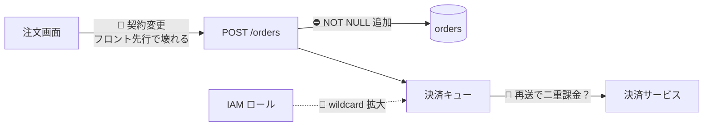

# レポートの形式

## 出力言語

**レポートはユーザーが書いている言語で書く。** 見出し・所見・説明・コメント案のすべてが対象。判断できない時は日本語にする（このツールキットは日本語で保守されている）。

次のものは元の形のまま残す。変えると壊れるか精度を失うため: ファイルパス、識別子、コマンド、コード抜粋、ログ出力、重大度の絵文字、エラー文字列、差分からの引用。コメント案の中でも、実在するシンボル名はそのまま書く。

## レビューに必ず入れるもの

埋めるテンプレートではなく、レビューの目的そのもの。1 つでも欠けたレポートは、所見の数に関係なく未完成。

| | 必須 | 場所 |
|---|---|---|
| **0** | **変更マップ** — 変更が触れるものの図に所見を載せたもの（変更に形がある場合）。飛ばしてよいが、**黙って飛ばさない。** | 「変更マップ」節 |
| **1** | **実際に何が変わったか。** 単位、他者から観測できる違い、仕組み、波及範囲。**最初に書き、所見がゼロでも書く。** | 「変更内容」節 |
| **2** | **その領域のテックリードとしての、批判的な多観点レビュー。** アーキテクチャ、集約とトランザクションの境界、セキュリティを最も重く見て、決して畳まない。 | 層ごとの観点クラスタ。どう畳んでも残る **5 つ** は `review-process.md` にある |
| **3** | **所見ごとに、この実装がなぜ誤りかを詳しく** — 仕組み、具体的な失敗、そこに至る経路、形がそれを招いているか — **加えて正確な行と、そこに残すコメント。** | [所見の示し方](#所見の示し方) |
| **4** | **重大度を段階で示し、基準も書く。** 何がブロックで何がそうでないかを読者が分かるように。 | [バケット分け](#バケット分け) |

次の 2 つも外せない。これが無いと上の 4 つが中身の無いまま通る。

| | 必須 | 場所 |
|---|---|---|
| **5** | **読んだものと仮定したもの**、そしてまったく確かめなかったもの。綺麗な結果は「この深さでは検出されなかった」であり、「安全」ではない。 | 骨格の 🔎 |
| **6** | **反証の件数。** 出した所見のうちいくつが潰れたか。反証ゼロは較正されていない。どちらだったかを書く。 | 骨格の 🔬 |

## 重複の統合

同じ `file` のおおむね ±5 行以内にある所見、または根本原因が同じ所見は **1 つにまとめる**。両方の観点を列挙し、**最も高い重大度** を取り、`why` と `recommendation` を合わせる。同じ問題を、気づいた観点の数だけ出さない。

## バケット分け

各所見は **ちょうど 1 つ** のバケットに数える。

**基準をレポート自体に書く。** 集計表の下に 1 行の凡例として。🔴 と 🟡 の違いが分からない読者はどちらにも動けない。

| バケット | 中身 | 読者にとっての意味 |
|---|---|---|
| ⛔ | `irreversible=true`。🔴 には重ねて数えない。 | **マージしない。** 出したら取り消せない: データ消失、破壊的マイグレーション、制御できない利用側への契約破壊、すでに使われた権限。 |
| 🔴 | 不可逆でない `critical`。 | **マージ前に直す。** 到達可能な正しさ・セキュリティ・テナント境界の欠陥。経路は仮定せず書き出す。 |
| 🟡 | warning | **直すべきだがブロックしない。** 実在するが限定的: 回復できる、または当面受け入れられる状態でしか到達しない。 |
| 💡 | info | **任意。** コメントの頭に `Nit:` を付け、ブロックしないと分かるようにする。 |
| 🧭 | 設計の妥当性、システム全体・伝播のリスク、未検証のまま格上げした clear。シニアなら問うが欠陥とは言えないもの。**ノイズ上限の対象外。** | **欠陥ではなく判断事項。** 「この形は後で高くつく」— 修正ではなく決定に値する。害が読めるようになったら 🔴/⛔ に移す。 |
| 👤 | 人間の判断が必要: 未検証の clear、未解決の到達可能性。 | **誰かの判断待ち。** 何を見れば、誰に聞けば決着するかを書く。 |

集計表の合計は、統合後の所見数と一致させる。

**出力予算** — **所見に対する唯一の上限であり、削ったものを開示する。** 🟡 は最大 7 件程度、💡 は最大 5 件程度。溢れた分は 1 つの集約メモにまとめ、🔬 に数える。⛔・🔴・🧭 は決して削らない。発見フェーズには順位による上限を持たせない（`finding-discipline.md`）。上限を 2 段にすると、内側で落ちた所見がどこにも数えられないため。

## 所見の示し方

⛔ と 🔴 の所見は **4 部すべてが必須**。🟡 も 4 部だが簡潔でよい。💡 は 1 行の要約にしてよい。

**1. 📍 場所** — `path/to/file.ts:123`。インラインコメントを付ける **正確な行**。範囲は `:120-135`。行の無い所見は所見ではなく印象。

**2. この実装がなぜ誤りか** — 技術的な根拠で、**短くしてはいけない部分。** 次の 4 つをこの順で書く。

- **コードが今していること。** 名前から推測せず、ファイルから読んだ実際の仕組み。効いている 2〜3 行を引用する。
- **具体的な失敗。** 特定の入力と状態 → 特定の誤った結果。「不整合が起きうる」ではなく「同じトランザクション窓に届いた 2 つのリクエストが両方 version 3 を読み、両方 version 4 を書き、2 つ目が 1 つ目の明細を黙って捨てる」。
- **そこに至る経路。** どの呼び出し元、どの権限、どのタイミングか。コードにあるだけの分岐と本番で走る分岐を分けるのがこれで、重大度の根拠になる。
- **この行だけでなく、形が招いているか。** 単なるうっかりか、構造がうっかりを起こしやすくしているか — ガードの無い不変条件、全呼び出し元の補正に依存するデフォルト、不正な状態を許す型。行だけ直す所見は、次の同じ誤りを残す。

> **この部分は長いという理由で落とさない。** レビューしていない人が所見に基づいて動けるのも、信じるかどうか決められるのもこの部分による。書けないなら、報告できるほど理解していない。そう書いて 👤 に移す。

**3. 平易な説明** — 2〜4 文。専門語は避ける（避けられなければ注釈する）。今の状況、何がまずいか、**放置すると誰の問題になるか。** 修正する人ではなくレポートを読む人向け。短くてよいが、無くてはいけない。

**4. 💬 コメント案** — その行に貼れる引用ブロックで書く。

> **[🔴/🟡] 1 行の要約。** 問題は何か（具体的な入力と状態 → 結果）→ なぜ重要か → 推奨する修正（関係する API、最小差分の方向、有用なら疑似コード）。確信度が低い時は「要確認: X」と書く。

コメントは **1 行だけ表示されても自立する** こと。レビュー UI は周囲の文脈なしで行に付けて表示する。コメントは 2 部の圧縮であって置き換えではない — **作者が行で読むのはコメント、レポートをレビュー可能にするのは 2 部。**

⛔ の各行には、行つきの 💬 コメント案を 1 つ付ける。👤 の各項目は、コメントの中に **何を見るか、誰に聞くか** を書く。

**任意のものはコメントの中で示す。** 欠陥ではなく好みのものは **`Nit:`** で始める。どのコメントがブロックなのか作者が分からないと、全部やるか全部無視するかになるため。

**個人的なスタイルの好みは所見ではない。** プロジェクトが規約を定めていない所では作者の選択を尊重する。書式に信用を使うレビューは、データを失うマイグレーションに使う信用が残らない。抑制の規則は `finding-discipline.md` にあり、ここはその示し方の側。

**これは提案であって投稿ではない。** スキルは読み取り専用。`gh pr review --comment` や `gh api` での実際の投稿は、ユーザーが明示的に頼んだ時だけ行い、その時は上の本文をそのまま使う。

---

## 変更マップ — 一枚絵、所見を載せたもの

**レポートの先頭、変更内容より前に Mermaid ブロックを置く。** GitHub・GitLab・多くの Markdown ビューアが ` ```mermaid ` をそのまま描画するので、ツール不要で Claude からも Cursor からも同じに見える。

**描く価値は変更ではなく、そこに載せた所見にある。** 差分が触れるものの図ならファイル一覧で足りる。**どこにリスクがあるか** を示す図は、所見の一覧からは再構成できない（2 つの所見が同じ辺だと気づくには、読者が頭の中でトポロジーを持つ必要がある）。

規則。どれも、素直に描くと無いより悪くなるから存在する。

- **ノードは読者が認識するもの** — 画面、エンドポイント、テーブル、キュー、リソース。**ファイルパスやクラス名ではない。** 内部構造の図は差分の繰り返し。
- **辺は変更が影響するもの** で、辺にリスクの印を付ける: `⛔` 不可逆、`🔴` 重大、`🧭` 設計への疑い。**印の無い辺は、見た上で何も無かったという意味** — 凡例にそう書き、綺麗な辺を書き漏れではなく表明にする。
- **地図に載せるのは ⛔ / 🔴 / 🧭 の所見だけ。** 🟡 と 💡 は表に置く。載せると「全部に印がある」になり、地図が情報を運ばなくなる。
- **地図に載せた所見は表にも載せる。** 地図は索引であって唯一の置き場ではない。図を飛ばした読者が何も失わないように。
- **ノードは十数個までにする。** それ以上は一覧として眺められ、それなら表の方がよい。本当に広い変更は領域でまとめ、何を畳んだかを書く。
- **形の無い変更では飛ばす。** 1 ファイル、1 フラグ、1 値なら表で足り、1 ノードの図はノイズ。**飛ばしたことと理由を書く。** 地図が無いのを忘れたと読まれないように。


```mermaid
flowchart LR
  FE["注文画面"] -->|"🔴 契約変更<br/>フロント先行で壊れる"| API["POST /orders"]
  API -->|"⛔ NOT NULL 追加"| DB[("orders")]
  API --> Q["決済キュー"]
  Q -->|"🧭 再送で二重課金？"| PAY["決済サービス"]
  IAM["IAM ロール"] -.->|"🔴 wildcard 拡大"| Q
  %% 印の無い辺 = 見た上で所見なし
```

層をまたぐレビューでは、地図は **境界の両側が同時に現れる唯一の場所** で、層ごとのレビューでは構造的に作れない。単一層のレビューでは任意 — 層の内部に見せる価値のあるトポロジーがあれば描き、無ければ飛ばす。

## レポートの骨格

`<層>` はバックエンド・フロントエンド・インフラのいずれかに置き換える。

```markdown
## <層> レビュー報告

<!-- 変更マップ（Mermaid）。形がある場合のみ。無い場合は飛ばした旨を書く -->

### 変更内容 — 常に最初、所見が無くても書く

**所見より先に書き、所見がゼロでも書く。** 差分を知らない読者は、これ無しにどの重要度も判断できない。

**表で書く。** 散文だと「観測できる変化」と「実装の説明」が混ざる。列があれば空欄が見える。

<!-- dotagents:change-table | 領域 | 変更前 | 変更後 | -->
| 領域 | 変更前 | 変更後 |
|---|---|---|
| 読者が認識するもの（画面・エンドポイント・テーブル・キュー・リソース）。**ファイルパスとクラス名は禁止** | 現在の挙動や値、短く。新規追加は `—` | 何になるか。短く |

`/da-pr-describe` と同じ 3 列。**同じ変更に 2 つの語彙があると、レビューと PR 説明が食い違う。**

**「なぜ」は列ではなく、表の直下に散文で 1〜2 文。** 列は短い値が並ぶ時に効き、文が入ると他の列が潰れる。

書く内容は差分・spec・PR 説明から読み取れる意図。**読み取れなければ「意図が読み取れなかった」と書く** —— それ自体が所見（👤）で、意図が無ければ意味的な正しさは判定できない。

表の下に 2 つ、散文で:

- **仕組み**: 2〜3 文。**仕組みを説明できないなら、まだレビューできる状態ではない。**
- **波及範囲**: Step 2 の追跡で出た関連ドメイン・モジュール・画面・スタック —— **そのうち読まなかったものも名指しする。**

### ⛔ 不可逆な箇所（最優先・検証済み）
| 場所 | 種類 | 取り消せない理由 | リリース前に確認すること |
|---|---|---|---|
| `file:line` | カラム削除 / API 破壊 / 削除 / 共有関数の波及 / リソース置換 | … | … |

（各行の後に、行つきの 💬 コメント案を 1 つ）

### 🔴 重大 / 🟡 警告 / 💡 参考 / 👤 人間の判断が必要
各所見を上の形式で。💡 は 1 行でよい。

### 🧭 設計とシステム全体への疑い
各項目: 疑い — なぜ気になるか — どう決着させるか。差分の外に出てよい。

### 🔎 このレビューの確度 —— 綺麗な結果を信じる前に必ず読む
- **読んだものと仮定したもの。** 特に、高リスク部分が依存する共有コード・基底コードを実際に開いたか。`file:line` で示す。
- 浅くしか見ていない領域と、確認できなかったこと。正直に。
- 注意書き: この結果は「この深さで差分の局所に欠陥が検出されなかった」という意味。「シニアが設計を承認した」ではない。

### 🔬 除外したもの（参考・件数のみ）
- 検証で反証された: N
- 確信度の閾値未満: N
- 出力予算で集約メモにまとめた（🟡/💡 のみ）: N
- **6b で確定した暫定の重大度: N、未確定のまま: N** — 到達可能性を追えず重大度を下げて置いた所見は、除外ではなく **未完了**。2 つの件数を分けて書き、「未確定」を暗黙にしない（書かれないゼロと測っていない残件は、ここでは見分けがつかない）。
（役に立つ場合だけ 1 行の要約。言い直さない）

### 📊 集計
| バケット | 件数 |
|---|---|
| ⛔ 不可逆な箇所 | |
| 🔴 重大 | |
| 🟡 警告 | |
| 💡 参考 | |
| 🧭 設計 / システム全体 | |
| 👤 人間の判断が必要 | |
| 🔬 除外 | |
```

## 変更が open な PR の時

レポートはここで完成で、これが **完全な** 集合。PR に載せるのはもっと小さいもの — 他人の注意に値する所見を、名前が載る本人の口調で。

**1 行で申し出て止まる。** 何も投稿しない。申し出も省かない（省くと作者が手で書き写すことになる）。ユーザーが望めば [`pr-comments.md`](pr-comments.md) に従う。選び方（**規則で選び、順位では選ばない**）、口調（`profiles/review-voice.md` から。無ければ作らずに尋ねる）、下書きをすべてそのまま見せること、1 バイトでも外に出す前に文字どおりの **`Go`** を待つことは、すべてそちらが持つ。

**`Go` はコメントを投稿する。** `--approve` や `--request-changes` には決してならない（PR のレビュー状態は常に人間のもの）。対象は 1 回の投稿だけで、作者が返信した後の回は含まない。

**選んでも何も落ちない。** すべてはレポートに残っている。だから部分集合を小さくしてよい。

**何も除外されていないレポートは較正されていない。** 穴を探せと言われたレビュアーは必ず何か見つける。そのすべてに対応すると過剰設計になる — 余分な抽象層、防御的なコード、起こりえないケースのテスト。除外がゼロなら、そう書いて理由を説明する。徹底したレビューとして通さない。

## 設計レビューでの置き換え

`da-design-review` は差分ではなく計画をレビューし、このファイルで報告する。置き換えは 3 つ。

- **⛔ は 🚪 一方通行の判断になる** — 出した後に戻すのが高いか不可能な決定。レポートの先頭に置く。各項目に、何が不可逆になるか、**どの時点で** なるか、安全に進むには何が成り立つ必要があるかを書く。時点を言えなければ一方通行の判断ではない。
- **🧭 はコードレビューより重い。** 計画段階なら「形が違う」は対応できる。実装後なら書き直しになる。
- **📍 は計画の節を指す。** 衝突するコードがあればその `file:line` も。

必須の 4 部を計画に読み替えると次のとおり。

| 部 | ここでの意味 |
|---|---|
| **1. 何が変わったか** | *計画が何をしようとしているか*。Step 1 から再掲して確認したもの。最初に置き、所見が無くても書く。 |
| **2. なぜ誤りか、詳しく** | 計画が含意する仕組み → 生む具体的な失敗 → **いつ** 生むか（どのデプロイ段階、どのマイグレーション、どの負荷）→ 1 文ではなく計画の形が招いているか。「遅くなる」はこれに当たらない。「backfill が実行中ずっと orders テーブルをロックし、計画は読み取り経路を移す前にそれを走らせる」がこれに当たる。 |
| **3. 平易な説明** | 決める人向けに 2〜4 文。専門語は注釈する。 |
| **4. 💬 コメント案** | その計画の節、または実装する PR に貼れるもの。 |

**計画は文書なので、書かれていないものはすべて欠けて見える。** だから設計レビューには反証のパスがあり、❓ は重大度ではなく独立したバケットになっている。
